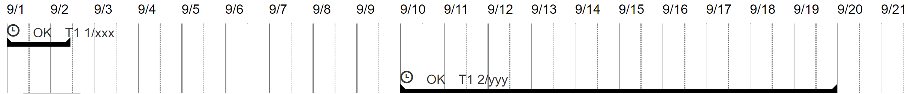

# js-simple-schedule

Draw Simple Schedule Bars On Browser.



## Usage

- Call JavaScript function as fllowings;

```javascript
const selector = '#schedule_div';
const opt = [];
schedule(selector ,opt);
```
- parameter ```opt``` contains schedule bar info which also has following properties.

  Here is schedule bar info.

  |Property|Description|
  |---|---|
  |period_from|Datetime for displaying-from on screen like  ```'2018-09-01 00:00:00'```|.
  |period_to|Datetime for displaying-to on screen.|
  |schedule_info|This property's type is array. Each element contains schedule info for each schedule bars respectively(To see following table).|

  Element of ```schedule_info```array has following properties.

  |Property|Description|
  |---|---|
  |id|Schedule id. This value will be drawn on own schedule bar.|
  |status|Schedule status.|
  |status_label|Schedule status label. This value will be drawn on own schedule bar.|
  |category|Schedule category. This value will be drawn on own schedule bar.|
  |target_type_label|Target type label. This value will be drawn on own schedule bar.|
  |title|Title (label). This value will be drawn on own schedule bar.|
  |start_date|Start datetime of schedule.|
  |end_date|End datetime of schedule.|

## Sample opt parameter.

Followings are sample opt parameter values.Same values are passed in ```sample.html```.

```javascript
{
    period_from: '2018-09-01 00:00:00',
    period_to: '2018-10-30 00:00:00',
    schedule_info: [
        {
            id: 1,
            status: 'OK',
            status_label: 'OK',
            category: 'cat1',
            target_type_label: 'T1',
            title: 'xxx',
            start_date: '2018-09-01 00:00:00',
            end_date: '2018-09-02 11:59:59'
        },
        {
            id: 2,
            status: 'OK',
            status_label: 'OK',
            category: 'cat2',
            target_type_label: 'T1',
            title: 'yyy',
            start_date: '2018-09-10 00:00:00',
            end_date: '2018-09-20 00:00:00'
        }
    ]
}
```